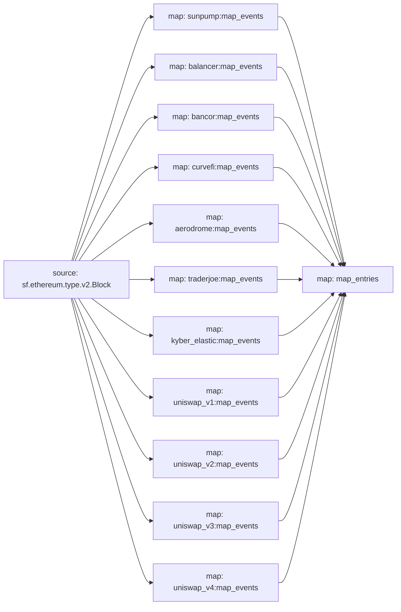

# Graph

```mermaid
graph LR;
  map_entries[map: map_entries];
  sunpump:map_events --> map_entries;
  balancer:map_events --> map_entries;
  bancor:map_events --> map_entries;
  curvefi:map_events --> map_entries;
  aerodrome:map_events --> map_entries;
  traderjoe:map_events --> map_entries;
  kyber_elastic:map_events --> map_entries;
  uniswap_v1:map_events --> map_entries;
  uniswap_v2:map_events --> map_entries;
  uniswap_v3:map_events --> map_entries;
  uniswap_v4:map_events --> map_entries;
  sunpump:map_events[map: sunpump:map_events];
  sf.ethereum.type.v2.Block[source: sf.ethereum.type.v2.Block] --> sunpump:map_events;
  balancer:map_events[map: balancer:map_events];
  sf.ethereum.type.v2.Block[source: sf.ethereum.type.v2.Block] --> balancer:map_events;
  bancor:map_events[map: bancor:map_events];
  sf.ethereum.type.v2.Block[source: sf.ethereum.type.v2.Block] --> bancor:map_events;
  curvefi:map_events[map: curvefi:map_events];
  sf.ethereum.type.v2.Block[source: sf.ethereum.type.v2.Block] --> curvefi:map_events;
  aerodrome:map_events[map: aerodrome:map_events];
  sf.ethereum.type.v2.Block[source: sf.ethereum.type.v2.Block] --> aerodrome:map_events;
  traderjoe:map_events[map: traderjoe:map_events];
  sf.ethereum.type.v2.Block[source: sf.ethereum.type.v2.Block] --> traderjoe:map_events;
  kyber_elastic:map_events[map: kyber_elastic:map_events];
  sf.ethereum.type.v2.Block[source: sf.ethereum.type.v2.Block] --> kyber_elastic:map_events;
  uniswap_v1:map_events[map: uniswap_v1:map_events];
  sf.ethereum.type.v2.Block[source: sf.ethereum.type.v2.Block] --> uniswap_v1:map_events;
  uniswap_v2:map_events[map: uniswap_v2:map_events];
  sf.ethereum.type.v2.Block[source: sf.ethereum.type.v2.Block] --> uniswap_v2:map_events;
  uniswap_v3:map_events[map: uniswap_v3:map_events];
  sf.ethereum.type.v2.Block[source: sf.ethereum.type.v2.Block] --> uniswap_v3:map_events;
  uniswap_v4:map_events[map: uniswap_v4:map_events];
  sf.ethereum.type.v2.Block[source: sf.ethereum.type.v2.Block] --> uniswap_v4:map_events;
```
